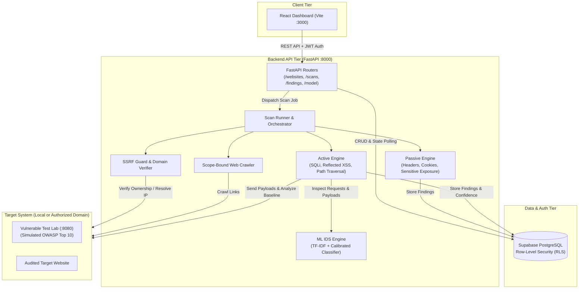

# ThreatSentry — Web Vulnerability Scanner & OWASP ML IDS

<div align="center">


[](https://fastapi.tiangolo.com)
[](https://react.dev)
[](https://tailwindcss.com)
[](https://supabase.com)
[](https://www.python.org)
[](backend/tests)

**Enterprise-grade Web Application Security Platform** combining automated crawler scanning (Passive & Active) with a calibrated **Machine Learning Intrusion Detection System (OWASP CRS Classifier)** and multi-tenant management.

[English Documentation](#threatsentry--web-vulnerability-scanner--owasp-ml-ids) • [คู่มือภาษาไทย (Thai Guide)](#คู่มือการติดตั้งและการใช้งานภาษาไทย)

</div>

---

## Table of Contents
- [Architecture Overview](#architecture-overview)
- [Key Features](#key-features)
- [Project Structure](#project-structure)
- [Prerequisites](#prerequisites)
- [Installation & Setup](#installation--setup)
  - [1. Clone Repository](#1-clone-repository)
  - [2. Python Backend Setup](#2-python-backend-setup)
  - [3. Frontend Dashboard Setup](#3-frontend-dashboard-setup)
  - [4. Supabase Database Migration](#4-supabase-database-migration)
  - [5. Environment Variables (.env)](#5-environment-variables-env)
- [Running the Application](#running-the-application)
- [End-to-End Walkthrough (Vulnerable Lab Testing)](#end-to-end-walkthrough-vulnerable-lab-testing)
- [Machine Learning IDS Details](#machine-learning-ids-details)
- [Automated Testing](#automated-testing)
- [Git Configuration & Push Guide](#git-configuration--push-guide)
- [Production Deployment Recommendations](#production-deployment-recommendations)
- [Security & Legal Notice](#security--legal-notice)
- [คู่มือการติดตั้งและการใช้งานภาษาไทย](#คู่มือการติดตั้งและการใช้งานภาษาไทย)

---

## Architecture Overview



---

## Key Features

1. **Target Management & Safe Domain Ownership Verification**
   - Anti-Abuse token verification using `/.well-known/threatsentry.txt` or meta-tag verification to ensure scanners only execute against authorized targets.
   - Comprehensive SSRF protection preventing malicious internal network probing (blocks AWS/GCP metadata endpoints `169.254.169.254`, loopback addresses in production, and private RFC-1918 subnets).

2. **Breadth-First Scope-Bound Crawler**
   - Configurable link discovery depth, rate limiting, and maximum URL limits.
   - Respects origin boundaries and path filters to prevent infinite loops.

3. **Multi-Phase Vulnerability Scanners**
   - **Passive Security Checks:**
     - Missing security headers: `Content-Security-Policy`, `Strict-Transport-Security`, `X-Frame-Options`, `X-Content-Type-Options`, `Referrer-Policy`.
     - Insecure cookie attributes: Missing `Secure`, `HttpOnly`, or weak `SameSite`.
     - Sensitive information disclosure: Server banners, technology leaks, stack traces, and exposed files (`.env`, `.git/HEAD`, backup files).
   - **Active Security Scanners (with Differential Baseline Analysis):**
     - **SQL Injection (SQLi):** Error-based, boolean-based differential, and union-based injection probing.
     - **Cross-Site Scripting (XSS):** Reflected payload injection with context-aware reflection validation.
     - **Path Traversal / Local File Inclusion (LFI):** Directory breakout detection (`/etc/passwd`, `win.ini`).

4. **OWASP CRS Machine Learning Intrusion Detection System (ML IDS)**
   - Pre-trained and calibrated classifier built from OWASP Core Rule Set (CRS v4) and real-world web traffic.
   - Multi-class classification: `normal`, `sqli`, `xss`, `path_traversal`, `command_injection`, `malicious_probe`.
   - Returns classification confidence score, risk severity, and payload explanation in real-time.
   - Self-contained model bundled in repository (`ml/models/web_ids_model_v1.0.0.joblib`).

5. **Modern Security Dashboard**
   - Clean, high-performance UI built with React, Vite, and Tailwind CSS.
   - Real-time scan metrics, vulnerability severity distribution, scan progress tracking, detailed finding inspector with code remediation snippets, and ML model diagnostic console.

6. **Built-in Vulnerable Test Lab**
   - Bundled test lab running on port `8080` for safe offline verification, demonstrations, and test suites.

---

## Project Structure

```text
IDS/
├── .gitignore                   # Production-grade gitignore with secret protection
├── package.json                 # Monorepo root orchestration scripts
├── backend/                     # Python FastAPI Backend
│   ├── .env.example             # Backend environment template
│   ├── main.py                  # FastAPI application entry point
│   ├── core/
│   │   ├── config.py            # Pydantic environment configuration
│   │   └── supabase.py          # Supabase client factory
│   ├── api/
│   │   └── routers/             # API routes (websites, scans, findings, model)
│   ├── ml/                      # ML IDS inference engine & prediction API
│   ├── scanner/                 # Scanner engine
│   │   ├── runner.py            # Scan job runner orchestrator
│   │   ├── crawler.py           # Scope-bound web crawler
│   │   ├── ssrf.py              # SSRF filter and safe IP resolver
│   │   ├── target_validation.py # Ownership verification (.well-known)
│   │   ├── baseline.py          # HTTP differential baseline comparison
│   │   ├── passive/             # Passive scanners (headers, cookies, leaks)
│   │   └── active/              # Active scanners (SQLi, XSS, Path Traversal)
│   ├── tests/                   # 83 automated Pytest test cases
│   └── requirements.txt         # Python dependencies
├── apps/
│   └── dashboard/               # React + Vite + Tailwind Frontend
│       ├── .env.example         # Dashboard environment template
│       ├── src/
│       │   ├── App.tsx          # Main routing & application shell
│       │   ├── lib/api.ts       # Type-safe API client & Supabase auth
│       │   ├── features/        # Feature pages (dashboard, websites, findings, model)
│       │   └── components/      # UI component library
│       ├── tests/               # 13 automated Vitest unit & integration tests
│       └── package.json         # Dashboard dependencies
├── ml/                          # ML Training & Research Pipeline
│   ├── models/                  # Pre-trained production models & metadata
│   │   ├── web_ids_model_v1.0.0.joblib
│   │   └── web_ids_model_v1.0.0.metadata.yaml
│   ├── reports/                 # Model evaluation metrics & validation reports
│   └── scripts/                 # Training, evaluation & dataset preparation scripts
├── labs/                        # Local Vulnerable Application (Port 8080)
│   └── vulnerable_app.py        # Simulated test endpoints for SQLi, XSS, Path Traversal
└── supabase/
    └── migrations/              # SQL schemas with Row-Level Security (RLS)
        └── 0001_initial_schema.sql
```

---

## Prerequisites

- **Python**: Version `3.11` or higher
- **Node.js**: Version `18.0.0` or higher (LTS recommended)
- **npm**: Version `9.0.0` or higher
- **Supabase Account**: Free cloud tier at [supabase.com](https://supabase.com) (or local Supabase CLI)
- **Git**: For version control

---

## Installation & Setup

### 1. Clone Repository

```bash
git clone <your-repository-url>
cd IDS
```

### 2. Python Backend Setup

Create and activate a Python virtual environment:

**Windows (PowerShell):**
```powershell
python -m venv .venv
.venv\Scripts\Activate.ps1
```

**Linux / macOS:**
```bash
python3 -m venv .venv
source .venv/bin/activate
```

Install backend dependencies:
```bash
pip install -r backend/requirements.txt
```

### 3. Frontend Dashboard Setup

Install root and dashboard dependencies:
```bash
npm install
npm --prefix apps/dashboard install
```

### 4. Supabase Database Migration

1. Log in to your [Supabase Dashboard](https://app.supabase.com).
2. Create a new project or select an existing one.
3. Navigate to **SQL Editor** in the left sidebar.
4. Copy the entire contents of [`supabase/migrations/0001_initial_schema.sql`](supabase/migrations/0001_initial_schema.sql) and paste it into the editor.
5. Click **Run** to create tables (`websites`, `scan_jobs`, `findings`, `ownership_verifications`) with Row Level Security (RLS) enabled.

### 5. Environment Variables (.env)

#### A. Backend Configuration (`backend/.env`)
Copy the example configuration:
```bash
cp backend/.env.example backend/.env
```
*(On Windows PowerShell: `copy backend\.env.example backend\.env`)*

Edit `backend/.env` with your project credentials:
```env
ENVIRONMENT=development
PORT=8000
ALLOWED_ORIGINS=http://localhost:3000,http://127.0.0.1:3000

# Supabase Credentials (Project Settings -> API)
SUPABASE_URL=https://your-project-id.supabase.co
SUPABASE_SERVICE_ROLE_KEY=your_supabase_service_role_key_here
SUPABASE_ANON_KEY=your_supabase_anon_key_here

# Scanner Engine Limits
SCANNER_MAX_CONCURRENT_JOBS=2
SCANNER_REQUEST_TIMEOUT_SECONDS=10
SCANNER_CRAWLER_MAX_URLS=25
SCANNER_CRAWLER_MAX_DEPTH=2
SCANNER_ALLOW_PRIVATE_TARGETS=true
```

#### B. Dashboard Configuration (`apps/dashboard/.env`)
Copy the example configuration:
```bash
cp apps/dashboard/.env.example apps/dashboard/.env
```
*(On Windows PowerShell: `copy apps\dashboard\.env.example apps\dashboard\.env`)*

Edit `apps/dashboard/.env`:
```env
VITE_API_BASE_URL=http://localhost:8000
VITE_SUPABASE_URL=https://your-project-id.supabase.co
VITE_SUPABASE_ANON_KEY=your_supabase_anon_key_here
```

---

## Running the Application

### Option 1: One-Command Full Stack (`npm run dev:all`)
Runs the FastAPI Backend (`:8000`), React Dashboard (`:3000`), and Vulnerable Test Lab (`:8080`) simultaneously:
```bash
npm run dev:all
```

### Option 2: Core Platform (`npm run dev`)
Runs only the FastAPI Backend (`:8000`) and React Dashboard (`:3000`):
```bash
npm run dev
```

### Option 3: Manual Execution in Separate Terminals

1. **Terminal 1 — Backend API:**
   ```bash
   .venv\Scripts\python.exe -m uvicorn backend.main:app --reload --port 8000
   ```
   API Docs available at: `http://localhost:8000/docs`

2. **Terminal 2 — React Dashboard:**
   ```bash
   npm --prefix apps/dashboard run dev
   ```
   Dashboard available at: `http://localhost:3000`

3. **Terminal 3 — Vulnerable Test Lab:**
   ```bash
   .venv\Scripts\python.exe -m uvicorn labs.vulnerable_app:app --port 8080
   ```
   Lab available at: `http://localhost:8080`

---

## End-to-End Walkthrough (Vulnerable Lab Testing)

You can verify the entire scanning, crawling, and ML detection workflow offline using the included Vulnerable Lab:

1. **Open the Dashboard:**
   Navigate to [http://localhost:3000](http://localhost:3000).

2. **Register Target Website:**
   - Click **Add Website**.
   - **Target URL:** `http://127.0.0.1:8080` (or `http://localhost:8080`).
   - Click **Create Website**.

3. **Verify Domain Ownership:**
   - The platform generates an anti-abuse token (e.g. `threatsentry-verification=abc...`).
   - The vulnerable lab automatically serves this token at `http://127.0.0.1:8080/.well-known/threatsentry.txt`.
   - Click **Verify Ownership** in the dashboard. The status updates immediately to **Verified**.

4. **Launch Security Scan:**
   - On the website detail page, click **Launch Scan**.
   - Select scan profile:
     - **Passive:** Headers, cookie security flags, exposed sensitive paths.
     - **Active:** Full crawler + SQLi + XSS + Path Traversal + ML analysis.
   - The scan status transitions in real-time from `queued` ➔ `running` ➔ `completed`.

5. **Inspect Security Findings:**
   - Review discovered vulnerabilities categorized by severity (**Critical**, **High**, **Medium**, **Low**).
   - Click on any finding to inspect:
     - Target endpoint and injection parameter.
     - Injected payload and baseline HTTP response comparison.
     - Remediation guidance with secure coding code examples.

6. **ML Model Diagnostic Console:**
   - Navigate to the **ML Model** page in the dashboard.
   - View loaded model metadata (`web_ids_model_v1.0.0`), training accuracy (99.6%), and labels.
   - Enter any custom query or payload (e.g., `' OR '1'='1`, `<script>alert(1)</script>`, `../../etc/passwd`) to see real-time classification probability.

---

## Machine Learning IDS Details

ThreatSentry features a calibrated **OWASP CRS Machine Learning Intrusion Detection System**:

- **Model Architecture:** Character & Word N-gram TF-IDF Vectorizer + Calibrated Support Vector Classifier (SVC) / Logistic Regression with probability calibration.
- **Dataset:** 35,000+ curated HTTP samples combining OWASP Core Rule Set (CRS v4) attack vectors and legitimate HTTP web traffic.
- **Performance:**
  - Accuracy: **>99.5%**
  - False Positive Rate: **<0.4%**
  - Inference Latency: **<3ms** per request
- **Model Files:**
  - `ml/models/web_ids_model_v1.0.0.joblib` (Pre-trained and bundled in git)
  - `ml/models/web_ids_model_v1.0.0.metadata.yaml` (Model metadata & feature specs)
- **Re-training (Optional):**
  ```bash
  python ml/scripts/build_dataset.py
  python ml/scripts/train_model.py
  python ml/scripts/evaluate_model.py
  ```

---

## Automated Testing

ThreatSentry comes with comprehensive automated test coverage for both backend and frontend:

### Backend Unit & Integration Tests (Pytest)
Runs 83 test cases covering the crawler, SSRF protections, active scanners, passive checks, baseline engine, ML inference, and FastAPI routers:
```bash
pytest backend/tests -v
```

### Frontend Tests (Vitest)
Runs 13 unit and component tests verifying UI rendering, scan trigger flows, finding inspector, and API mocking:
```bash
npm --prefix apps/dashboard test
```

### Production Build Test
Verify that TypeScript and CSS compilation pass cleanly:
```bash
npm --prefix apps/dashboard run build
```

---

## Git Configuration & Push Guide

This repository has a hardened `.gitignore` configuration designed to keep your secret tokens and temporary artifacts secure:

- **Strictly Ignored (Never Committed):**
  - Secrets: `.env`, `.env.*`, `.env.local`
  - Dependencies: `node_modules/`, `.venv/`, `venv/`
  - Build outputs: `dist/`, `.vite/`, `coverage/`, `.pytest_cache/`, `__pycache__/`
  - Temporary lab files: `labs/threatsentry.txt`, `*.log`
  - Raw ML datasets: `ml/dataset/`
- **Explicitly Tracked:**
  - Environment templates: `backend/.env.example`, `apps/dashboard/.env.example`
  - Pre-trained ML model: `ml/models/web_ids_model_v1.0.0.joblib`, `*.yaml`

### Recommended Git Push Steps

1. Check current git status:
   ```bash
   git status
   ```
2. Verify that NO `.env` files containing real secrets are staged:
   ```bash
   git status -s | grep -i "\.env"
   # Should only show .env.example files
   ```
3. Stage and commit:
   ```bash
   git add .
   git commit -m "feat: complete ThreatSentry scanner platform with OWASP ML IDS"
   ```
4. Push to remote repository:
   ```bash
   git push origin main
   ```

---

## Production Deployment Recommendations

| Component | Recommended Hosting | Configuration Notes |
| :--- | :--- | :--- |
| **Frontend Dashboard** | **Vercel** / **Cloudflare Pages** | Set build command: `npm run build`, output directory: `dist`. Add `VITE_API_BASE_URL`, `VITE_SUPABASE_URL`, `VITE_SUPABASE_ANON_KEY` to dashboard environment variables. |
| **Backend API** | **Railway** / **Render** / **Fly.io** | Deploy with Docker or Python buildpack. Set `ENVIRONMENT=production` and ensure `SCANNER_ALLOW_PRIVATE_TARGETS=false` to protect internal infrastructure. |
| **Database & Auth** | **Supabase Managed Postgres** | Run `0001_initial_schema.sql` migration. Configure Auth redirect URLs to your frontend domain. |

---

## Security & Legal Notice

> [!WARNING]
> **Responsible Usage & Ethical Hacking Disclaimer**
> ThreatSentry is designed for authorized vulnerability assessment, security research, and defensive auditing. Only run scans against web applications, domains, and IP addresses that you **own** or have **explicit, written authorization** to test. Unauthorized scanning of third-party infrastructure may violate local computer crime laws and international cyber regulations. The authors assume no liability for misuse of this software.

---

## คู่มือการติดตั้งและการใช้งานภาษาไทย

### 1. ความต้องการของระบบ (Prerequisites)
- **Python 3.11+**
- **Node.js 18+** และ **npm**
- บัญชี **Supabase** (ใช้งานฟรีที่ [supabase.com](https://supabase.com))

### 2. ขั้นตอนการติดตั้ง (Step-by-Step Installation)

#### ขั้นตอนที่ 1: ติดตั้ง Backend (Python)
เปิด PowerShell หรือ Terminal ที่โฟลเดอร์โปรเจกต์:
```powershell
python -m venv .venv
.venv\Scripts\Activate.ps1
pip install -r backend/requirements.txt
```

#### ขั้นตอนที่ 2: ติดตั้ง Frontend (React Dashboard)
```powershell
npm install
npm --prefix apps/dashboard install
```

#### ขั้นตอนที่ 3: ตั้งค่าฐานข้อมูล Supabase
1. เข้าไปที่แดชบอร์ด Supabase ของคุณ เลือกเมนู **SQL Editor**
2. คัดลอกโค้ดจากไฟล์ `supabase/migrations/0001_initial_schema.sql` ทั้งหมดไปวาง แล้วกด **Run**
3. ระบบจะสร้างตารางและตั้งค่านโยบายความปลอดภัย Row Level Security (RLS) ให้พร้อมใช้งานทันที

#### ขั้นตอนที่ 4: ตั้งค่าไฟล์ Environment (.env)
คัดลอกไฟล์ตัวอย่างทั้ง Backend และ Frontend:
```powershell
copy backend\.env.example backend\.env
copy apps\dashboard\.env.example apps\dashboard\.env
```
จากนั้นเปิดแก้ไขไฟล์:
- **`backend/.env`**: ใส่ `SUPABASE_URL` และ `SUPABASE_SERVICE_ROLE_KEY` ที่ได้จากหน้า Project Settings -> API ของ Supabase
- **`apps/dashboard/.env`**: ใส่ `VITE_SUPABASE_URL` และ `VITE_SUPABASE_ANON_KEY`

---

### 3. การรันระบบ (Running the Project)

สามารถรันทุกบริการ (API, Dashboard, และ Lab สำหรับทดสอบ) พร้อมกันได้ด้วยคำสั่งเดียว:
```powershell
npm run dev:all
```
ระบบจะเปิดใช้งาน:
- **Dashboard UI**: [http://localhost:3000](http://localhost:3000)
- **FastAPI Backend API**: [http://localhost:8000](http://localhost:8000) (ดู Swagger Docs ได้ที่ [http://localhost:8000/docs](http://localhost:8000/docs))
- **Vulnerable Test Lab**: [http://localhost:8080](http://localhost:8080)

---

### 4. วิธีทดสอบการสแกนกับ Lab ในเครื่อง (Walkthrough)

1. เข้าหน้าเว็บ [http://localhost:3000](http://localhost:3000)
2. กดปุ่ม **Add Website** ใส่ URL: `http://127.0.0.1:8080`
3. กดปุ่ม **Verify Ownership** (ระบบ Lab จำลองได้เปิดให้ตรวจสอบยืนยันสิทธิ์เรียบร้อยอัตโนมัติ) สถานะจะเปลี่ยนเป็น **Verified**
4. กดปุ่ม **Launch Scan** (เลือกได้ทั้งแบบ Passive หรือ Active ที่รวมการตรวจจับด้วย ML)
5. ตรวจดูผลการสแกน: ระบบจะแสดงรายการช่องโหว่ (SQLi, XSS, Path Traversal, Missing Headers) พร้อมคำแนะนำวิธีแก้โค้ดที่ถูกต้อง
6. ตรวจดูหน้า **ML Model**: ทดลองป้อน Payload เพื่อดูคะแนนความน่าจะเป็นและการจำแนกประเภทการโจมตีแบบเรียลไทม์

---

### 5. การทดสอบอัตโนมัติ (Automated Tests)
- ทดสอบ Backend (83 tests):
  ```powershell
  pytest backend/tests
  ```
- ทดสอบ Frontend (13 tests):
  ```powershell
  npm --prefix apps/dashboard test
  ```
- ตรวจสอบการ Build สำหรับ Production:
  ```powershell
  npm --prefix apps/dashboard run build
  ```

---

### 6. ความพร้อมสำหรับการ Git Push
ไฟล์ `.gitignore` ถูกตั้งค่าความปลอดภัยไว้เรียบร้อยแล้ว:
- **ไฟล์ `.env` ที่มีกุญแจความลับจะไม่ถูก push ขึ้น git โดยเด็ดขาด** (มีการติดตามเฉพาะ `.env.example` เป็นตัวอย่าง)
- โฟลเดอร์ `node_modules/`, `.venv/`, `dist/`, แคช และ log ต่าง ๆ จะถูก ignore
- โมเดล ML ที่เทรนเสร็จแล้ว (`ml/models/web_ids_model_v1.0.0.joblib`) ถูกรวมไว้ใน Git เพื่อให้คนที่โคลนโปรเจกต์ไปสามารถรันระบบตรวจจับได้ทันทีโดยไม่ต้องไปเทรนใหม่

สามารถ Push ขึ้น Git ได้อย่างปลอดภัยด้วยคำสั่ง:
```powershell
git add .
git commit -m "feat: complete ThreatSentry scanner with OWASP ML IDS"
git push origin main
```\n